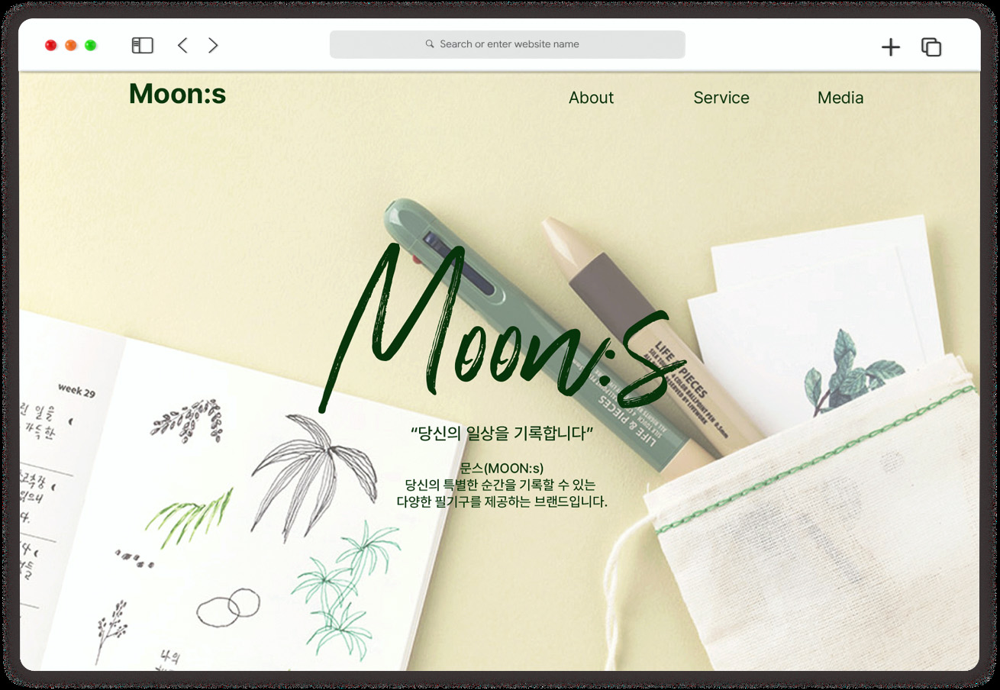

# **MOON:s Project**(Collaborate with designers)

## Designer : 2

## FrontEnd : 1

## ※ **추후 개발 UI function** 

▶ mouse event 
▶ Modals 
▶ Sidebar 
▶ Card 
▶ Doner Menu 
▶ Loader 
▶ mobile environment 

## 웹사이트 소개

### **Goal**

브랜드와 앱에 대한 정보를 보기 좋게 정리하여 사용자들이 MOON:s 브랜드에 더 많은 관심을 갖도록 하는 것이 목적이다.

### **Design Concept**

일상의 순간을 기록하기 위한 필기구를 구해말 목적을 가진 사용자들 위해 쉽게 다가오고 편하게 볼 수 있도록 따뜻한 색을 사용했고 편안하고 부드러운 이미지와 감성적인 손글씨체 강조했다.

### **Concept Keyword**

따뜻함, 감성, 손글씨
